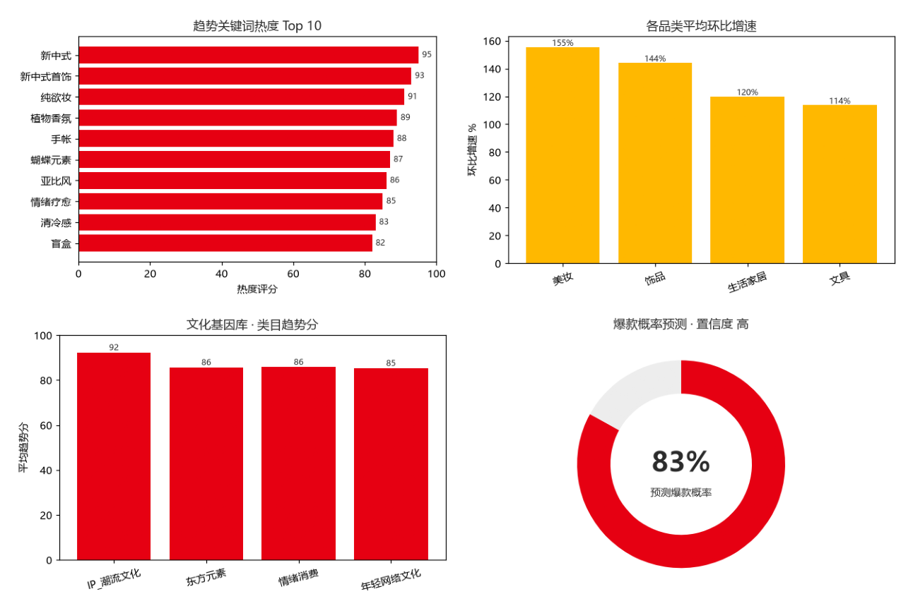

# MINISO AI Product Genome

> AI 产品开发智能体架构 · 为名创优品类目打造的产品基因引擎

[](https://github.com/ledi13035/MINISO-AI-Product-Genome/actions/workflows/test.yml)

---

## 🎯 项目目标

名创优品（MINISO）每年需要快速响应潮流文化、IP 联名、东方美学、年轻消费情绪等多维信号，开发上千 SKU。传统"拍脑袋选品 + 调研"链路慢、成本高、容易错过窗口期。

**MINISO AI Product Genome** 是一套 **多智能体协同的产品开发架构**，输入用户需求和品类，输出：

- 产品概念与命名
- 市场洞察与文化基因拆解
- 设计元素与材料建议
- 营销主题
- 爆款概率预测

让产品开发从"经验驱动"变成" **AI + 文化基因 + 数据**"驱动。

---

## 🧬 核心理念：AI Cultural Genome（文化基因库）

名创优品大量产品依赖四大文化基因：

| 基因类别 | 示例 |
|---------|------|
| **IP / 潮流文化** | 迪士尼、Sanrio、Loopy、Chiikawa |
| **东方元素** | 故宫纹样、敦煌壁画、宋画意境、节气 |
| **情绪消费** | 治愈、解压、陪伴、亚比风、Citywalk |
| **年轻网络文化** | B站梗、抖音爆款、小红书趋势、二次元 |

**AI 拆解文化基因 → 重组生成符合目标用户的新产品语言。**

---

## 🏗️ 系统架构

```
                        用户需求
                (目标用户 / 品类 / 价格 / 关键词)
                            ↓
            ┌───────────────────────────────┐
            │   MINISO AI Product Genome     │
            │      (产品基因引擎)             │
            └───────────────┬───────────────┘
                            ↓
        ┌──────────┬──────────┬──────────┬──────────┐
        │ Trend    │ Consumer │ Design   │Prediction│
        │ Agent    │ Agent    │ Agent    │ Agent    │
        │ 趋势智能体│ 用户智能体│ 设计智能体│ 预测智能体│
        └────┬─────┴────┬─────┴────┬─────┴────┬─────┘
             │          │          │          │
             └──────────┴──────────┴──────────┘
                            ↓
                    产品决策报告
            (名称 / 洞察 / 设计 / 材料 / 营销 / 爆款概率)
                            ↓
        设计团队 · 供应链团队 · 营销团队
```

四个 Agent 既可运行在 **本地规则引擎**（零依赖、可离线、可测试），也可在设置 `OPENAI_API_KEY` 后切换为 **GPT-4o 真实分析**。

---

## 🧩 四个核心 Agent

| Agent | 职责 | 关键输入 | 关键输出 |
|------|------|---------|---------|
| **Trend Agent** | 分析平台趋势信号 | 类目、平台、时间窗 | 趋势关键词、热度评分、环比增速 |
| **Consumer Agent** | 解析目标用户画像与情绪需求 | 年龄、性别、场景 | 用户洞察、情绪价值点 |
| **Design Agent** | 调用文化基因库重组设计语言 | 关键词、风格标签 | 设计元素、配色、材料 |
| **Prediction Agent** | 综合信号预测爆款概率 | 趋势/用户/设计信号 | 爆款概率、风险提示、立项建议 |

> 每个 Agent 同时提供 `run()`（规则引擎）与 `analyze(llm, ...)`（LLM 驱动）两条路径；当 LLM 不可用或返回异常时自动回退到规则引擎，保证框架永远可运行。

---

## 🚀 快速开始

```bash
git clone https://github.com/ledi13035/MINISO-AI-Product-Genome.git
cd MINISO-AI-Product-Genome

# 1) 安装依赖
pip install -r requirements.txt -r requirements-dev.txt

# 2) 跑 demo（无需 API key，使用本地规则引擎）
python demo/product_generation_demo.py

# 3) 跑单元测试
pytest
```

### 接入真实 LLM（GPT-4o）

设置 `OPENAI_API_KEY` 后，四个 Agent 会自动切换为 GPT-4o 真实分析，让趋势研判、用户洞察、设计语言、立项建议由大模型生成：

```bash
cp .env.example .env
# 在 .env 中填入 OPENAI_API_KEY=sk-...
export OPENAI_API_KEY=sk-...

python demo/product_generation_demo.py          # 自动走 GPT-4o
python demo/product_generation_demo.py --no-llm # 强制走规则引擎
python demo/product_generation_demo.py --category 饰品 --keywords 新中式 蝴蝶
```

统一接入层见 [`agents/llm.py`](agents/llm.py)：无 key 时安全回退，测试时可注入 `MockLLM`，并兼容 Azure / 任意 OpenAI 兼容端点（`OPENAI_BASE_URL`）。

---

## 📊 决策报告可视化

由 [`visualization/generate_dashboard.py`](visualization/generate_dashboard.py) 基于 `dataset/` 样例数据用 matplotlib 实时生成（**非占位图**）：



```bash
python visualization/generate_dashboard.py   # 输出 visualization/dashboard.png
```

---

## 🧪 测试与 CI

- `tests/` 下使用 **pytest** 覆盖：各 Agent 规则逻辑、JSON 解析鲁棒性、以及经 `MockLLM` 注入的完整 LLM 代码路径。
- `.github/workflows/test.yml`：每次 `push` / `PR` 自动在 Python 3.10 / 3.11 / 3.12 上安装依赖并运行 `pytest`，零 API key 也能跑通（规则引擎 + MockLLM 兜底）。

```bash
pytest -v
```

---

## 📁 仓库结构

```
MINISO-AI-Product-Genome
├── README.md                     ← 你正在看的
├── requirements.txt              ← 运行依赖
├── requirements-dev.txt          ← 测试依赖
├── pytest.ini / conftest.py      ← 测试配置
├── .env.example                  ← LLM key 模板
├── .github/workflows/test.yml    ← CI/CD 流水线
├── agents/
│   ├── __init__.py
│   ├── llm.py                    ← 统一 LLM 接入层 (GPT-4o / MockLLM)
│   ├── trend_agent.py            ← 趋势智能体
│   ├── consumer_agent.py         ← 用户智能体
│   ├── design_agent.py           ← 设计智能体
│   └── prediction_agent.py       ← 预测智能体
├── dataset/
│   ├── trend_sample.csv          ← 趋势数据样例
│   ├── product_features.json     ← 产品特征 / 文化基因库
│   └── consumer_feedback.json    ← 用户反馈数据
├── demo/
│   └── product_generation_demo.py← 一键运行 demo
├── visualization/
│   ├── generate_dashboard.py      ← 真实图表生成脚本
│   └── dashboard.png             ← 决策报告可视化（真实图）
└── docs/
    ├── business_analysis.md       ← 商业分析
    ├── AI_architecture.md         ← AI 架构详细设计
    └── competition_report.md      ← 竞品调研
```

---

## 🛣️ Roadmap

- [x] 多 Agent 架构原型
- [x] 文化基因库（4 大类目种子数据）
- [x] 端到端 demo 跑通（规则引擎 + LLM 双路径）
- [x] 接入真实 LLM（GPT-4o）替代规则引擎
- [x] pytest 单元测试 + GitHub Actions CI
- [x] matplotlib 真实可视化图表
- [ ] 接入真实电商数据 API（淘宝/天猫/京东）
- [ ] 文化基因库扩展到 20+ 类目
- [ ] 爆款预测模型训练（基于名创优品历史 SKU 销售）
- [ ] 设计稿自动生成（Stable Diffusion + ControlNet）

---

## 🤝 适用场景

- 名创优品品类经理的 **选品辅助工具**
- 创业团队的 **MVP 产品概念验证**
- 设计团队的 **风格探索起点**
- 学术研究：多智能体协同决策 / 文化基因计算

---

## 📄 License

MIT
